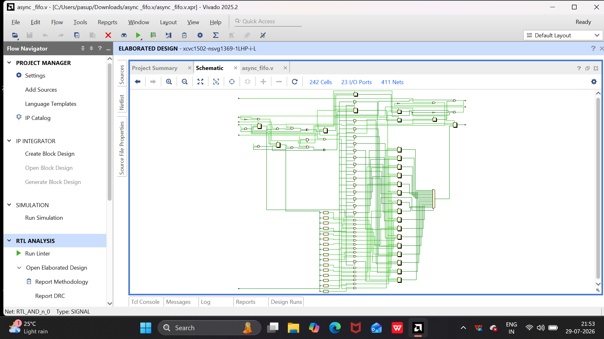
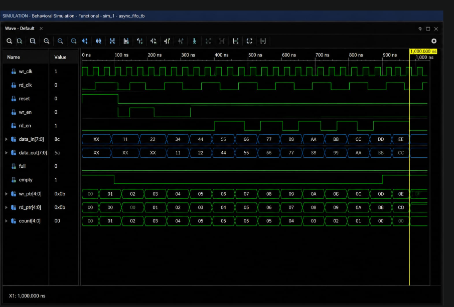

# asynchronous-FIFO-network-buffer-core-and-verification-array
This project implements an Asynchronous First-In-First-Out (FIFO) memory using Verilog HDL. The FIFO enables reliable data transfer between two independent clock domains by using separate write and read clocks. The design supports safe clock domain crossing while maintaining the correct order of data.
This project implements an *Asynchronous First-In-First-Out (FIFO)* memory using *Verilog HDL*.

The FIFO is designed to transfer data reliably between *two independent clock domains* using separate *write and read clocks*. It maintains the correct order of data while handling clock-domain crossing (CDC) safely.

The project also includes a *Verilog testbench* for functional simulation and verification of FIFO read/write operations, status flags, pointer movement, and data integrity.

---

## 🎯 Objectives

- Design an asynchronous FIFO using Verilog HDL
- Support data transfer between independent clock domains
- Implement safe Clock Domain Crossing (CDC)
- Generate FULL and EMPTY status flags
- Maintain FIFO data ordering
- Verify FIFO functionality using a dedicated testbench
- Analyze simulation waveforms using Xilinx Vivado
-----

### 📊 Simulation Waveform


### 📊 with testbench waveform


## 🏗️ Architecture

The asynchronous FIFO consists of:

- *Write Clock Domain*
  - Write pointer
  - Write enable control
  - FIFO memory write operation
  - Full flag generation

- *Read Clock Domain*
  - Read pointer
  - Read enable control
  - FIFO memory read operation
  - Empty flag generation

- *Clock Domain Crossing*
  - Pointer synchronization between clock domains
  - Gray-code based pointer transfer for safer CDC operation

### Basic Architecture

```text
                WRITE CLOCK DOMAIN
             ┌──────────────────────┐
             │  Write Control       │
wr_clk ─────►│  Write Pointer       │
wr_en  ─────►│  Full Detection      │
             └──────────┬───────────┘
                        │
                        ▼
                 ┌─────────────┐
                 │ FIFO Memory │
                 └──────┬──────┘
                        │
                        ▼
             ┌──────────────────────┐
rd_en  ─────►│  Read Control        │
rd_clk ─────►│  Read Pointer        │
             │  Empty Detection     │
             └──────────────────────┘
                READ CLOCK DOMAIN

